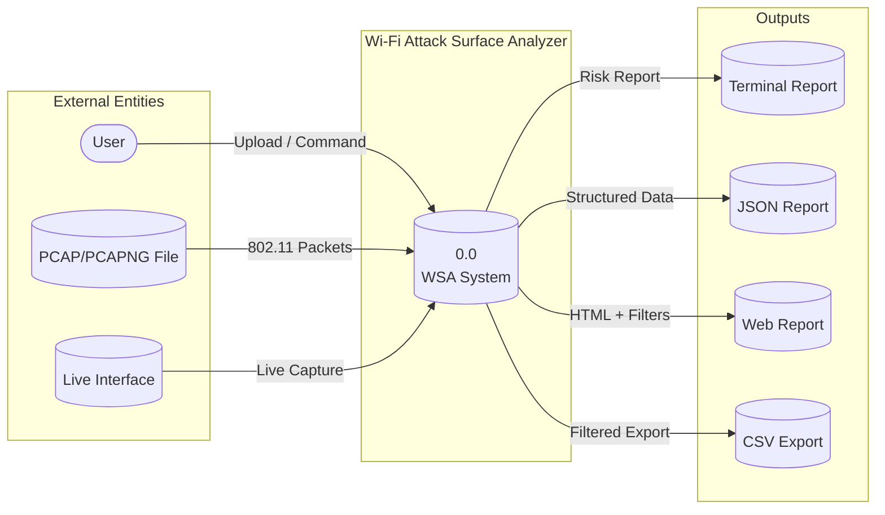
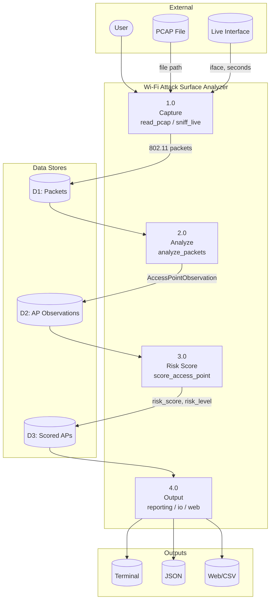
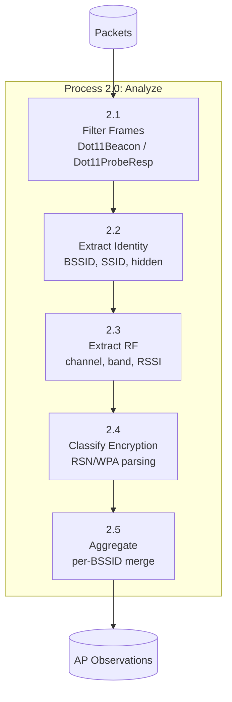
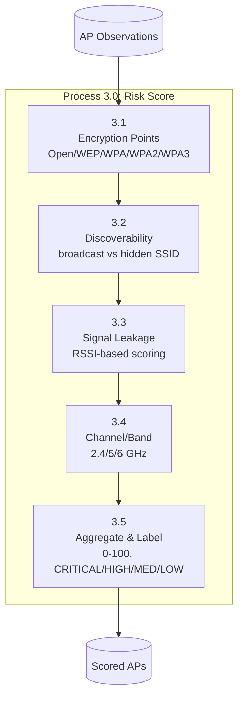
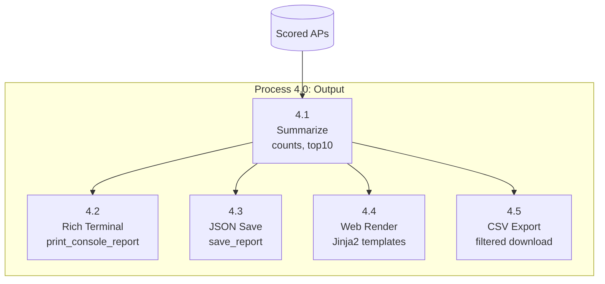

# Wi-Fi Attack Surface Analyzer

Research-oriented **Wi-Fi attack surface analyzer** that performs **passive reconnaissance** (PCAP-first) and produces a **context-aware, attacker-centric risk prioritization** of discovered access points.

---

## What It Does

- **Passive recon** from 802.11 management frames (beacons / probe responses)
  - SSID visibility (broadcast vs hidden)
  - BSSID, channel, band
  - Encryption posture: Open / WEP / WPA / WPA2 / WPA3 (best-effort classification)
  - Optional signal strength (RSSI) when present in capture metadata
- **Risk scoring** focused on attack feasibility (0–100 scale)
- **Outputs**
  - Human-friendly terminal report (Rich)
  - Structured **JSON** for automation
  - **Web UI** with filters, JSON/CSV export

---

## Data Flow Diagrams (DFD)

### Level 0 – Context Diagram

Shows the system boundary and external entities interacting with the analyzer.



**Data flows:**
- **Input:** User commands, PCAP file path, live interface + duration
- **Output:** Terminal report, JSON file, Web HTML report, CSV export

---

### Level 1 – Main Process Decomposition

Decomposes the system into four main processes.



**Processes:**
| ID | Process | Module | Description |
|----|---------|--------|-------------|
| 1.0 | Capture | `capture.py` | Read PCAP or sniff live 802.11 traffic |
| 2.0 | Analyze | `analyze.py` | Parse beacons/probe responses, build per-BSSID observations |
| 3.0 | Risk Score | `risk.py` | Compute feasibility-based risk score per AP |
| 4.0 | Output | `reporting.py`, `io.py`, `web/` | Terminal, JSON, Web UI, CSV |

---

### Level 2 – Detailed Sub-Processes

#### Process 2.0 – Analyze (Expanded)



#### Process 3.0 – Risk Score (Expanded)



#### Process 4.0 – Output (Expanded)



---

## Quick Start

### Install

```bash
python -m venv .venv
.venv\Scripts\activate   # Windows
# source .venv/bin/activate  # Linux/macOS
pip install -r requirements.txt
pip install -e .
```

### Analyze a PCAP/PCAPNG

```bash
python -m wifi_surface_analyzer scan pcap "path\to\capture.pcapng" --out reports\scan.json --format both
```

### Report from saved JSON

```bash
python -m wifi_surface_analyzer report reports\scan.json
```

### Live capture (Linux monitor mode)

```bash
sudo python -m wifi_surface_analyzer scan live --iface wlan0mon --seconds 30 --out reports\scan.json --format both
```

### Web UI

```bash
wsa-web --host 127.0.0.1 --port 8000
```

Open `http://127.0.0.1:8000` in your browser and upload a `.pcap` / `.pcapng`.

---

## Project Layout

| Path | Purpose |
|------|---------|
| `src/wifi_surface_analyzer/cli.py` | CLI entrypoints (`scan`, `report`) |
| `src/wifi_surface_analyzer/capture.py` | PCAP read + live sniff |
| `src/wifi_surface_analyzer/analyze.py` | 802.11 frame parsing + aggregation |
| `src/wifi_surface_analyzer/risk.py` | Feasibility-oriented scoring |
| `src/wifi_surface_analyzer/reporting.py` | Rich tables / summaries |
| `src/wifi_surface_analyzer/io.py` | JSON save/load |
| `src/wifi_surface_analyzer/models.py` | `AccessPointObservation` dataclass |
| `src/wifi_surface_analyzer/web/` | FastAPI Web UI |

---

## Documentation

- [**Full Project Documentation**](docs/README.md) – Architecture, API, data model, risk model
- [**Data Flow Diagrams (DFD)**](docs/DFD.md) – 3-level DFD (context, level 1, level 2)
- [**Project Details**](docs/PROJECT_DETAILS.md) – Data model, risk model, JSON shape
- [**Abstract**](Abstract.md) – Research abstract

---

## Ethics / Legal

Use only on networks you own or have explicit permission to assess. Passive capture can still be regulated by policy and law in your jurisdiction.

---

## References

- [Scapy](https://scapy.readthedocs.io/) – 802.11 / Dot11 layers
- [Rich](https://rich.readthedocs.io/) – Terminal output
- [802.11 / RSN (WPA2/WPA3) information elements](https://mrncciew.com/2014/10/08/802-11-mgmt-beacon-frame/)
- [Radiotap](https://www.radiotap.org/) – RSSI metadata in captures
