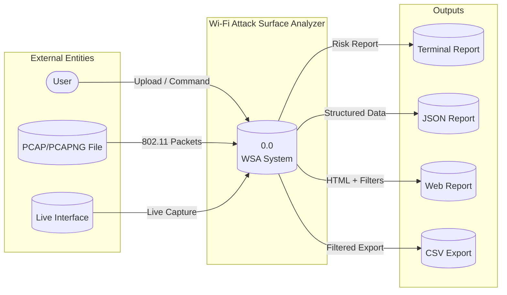
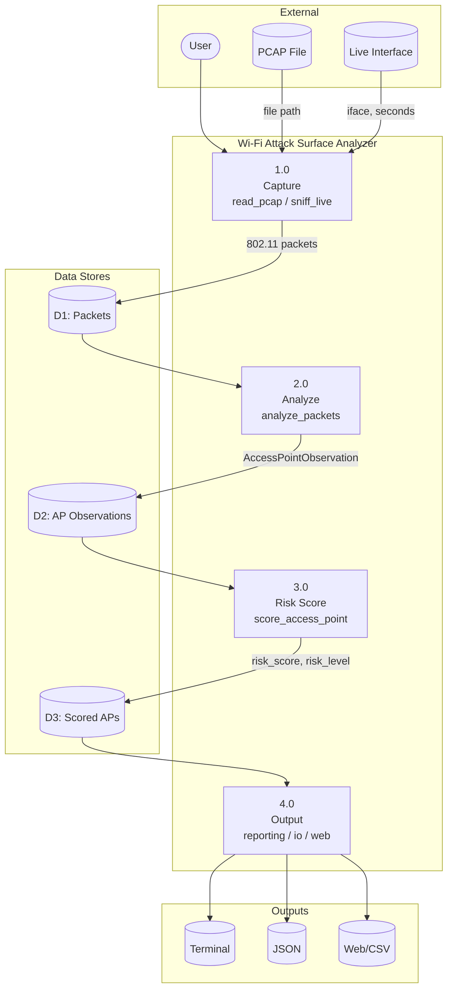
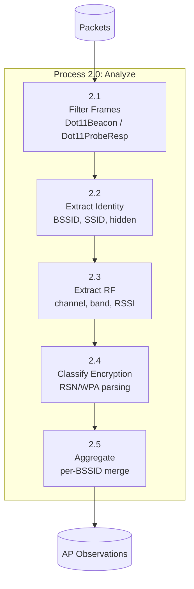
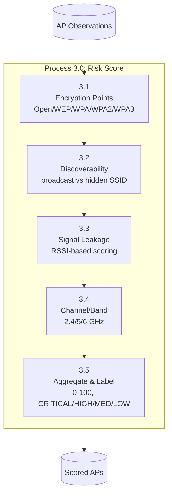
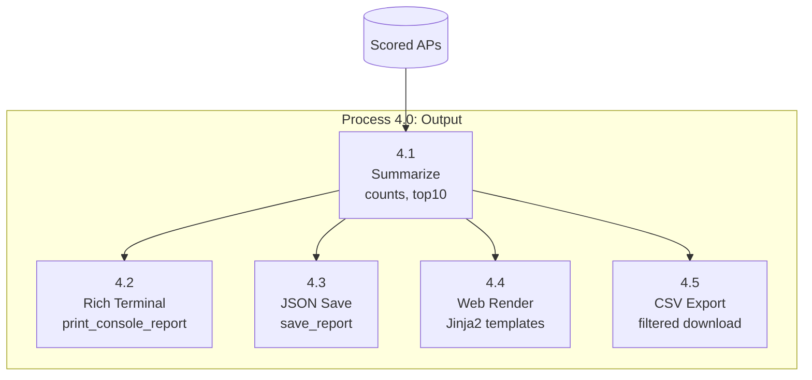

# Data Flow Diagrams (DFD)

This document provides the 3-level Data Flow Diagrams for the Wi-Fi Attack Surface Analyzer.

---

## Level 0 – Context Diagram

Shows the system boundary and external entities.

**External entities:**
- **User:** Initiates scans, uploads files, views reports
- **PCAP File:** Pre-captured 802.11 traffic
- **Live Interface:** Monitor-mode wireless interface (Linux)

**Outputs:**
- Terminal report (Rich)
- JSON report file
- Web HTML report
- CSV export (filtered)

---

## Level 1 – Main Process Decomposition

Four main processes and data stores.

| Process | Module | Input | Output |
|---------|--------|-------|--------|
| 1.0 Capture | capture.py | Path / iface+seconds | 802.11 packets |
| 2.0 Analyze | analyze.py | Packets | AccessPointObservation per BSSID |
| 3.0 Risk Score | risk.py | AP observations | Scored APs with risk_score, risk_level |
| 4.0 Output | reporting, io, web | Scored APs + summary | Terminal, JSON, Web, CSV |

---

## Level 2 – Detailed Sub-Processes

### Process 2.0 – Analyze (Expanded)

| Sub-process | Description |
|-------------|-------------|
| 2.1 Filter Frames | Keep only Dot11Beacon and Dot11ProbeResp |
| 2.2 Extract Identity | BSSID (addr2/addr3), SSID (EID 0), ssid_hidden |
| 2.3 Extract RF | Channel (EID 3), band from channel, RSSI from RadioTap |
| 2.4 Classify Encryption | Parse RSN/WPA IEs, map to OPEN/WEP/WPA/WPA2/WPA3 |
| 2.5 Aggregate | Merge per BSSID, update as better data arrives |

### Process 3.0 – Risk Score (Expanded)

| Sub-process | Description |
|-------------|-------------|
| 3.1 Encryption | OPEN=45, WEP=55, WPA=30, WPA2-PSK=20, WPA3-SAE=5, etc. |
| 3.2 Discoverability | Hidden=3, broadcast=10 |
| 3.3 Signal Leakage | Strong RSSI = higher points (2–20) |
| 3.4 Channel/Band | 2.4GHz=6, 5GHz=4, unknown=2 |
| 3.5 Aggregate | Sum, clamp 0–100, assign level |

### Process 4.0 – Output (Expanded)

| Sub-process | Description |
|-------------|-------------|
| 4.1 Summarize | Count by level, top 10 by risk |
| 4.2 Rich Terminal | Rich table, summary counts |
| 4.3 JSON Save | Write meta, access_points, summary |
| 4.4 Web Render | Jinja2 report.html with filters |
| 4.5 CSV Export | Filtered CSV download |
